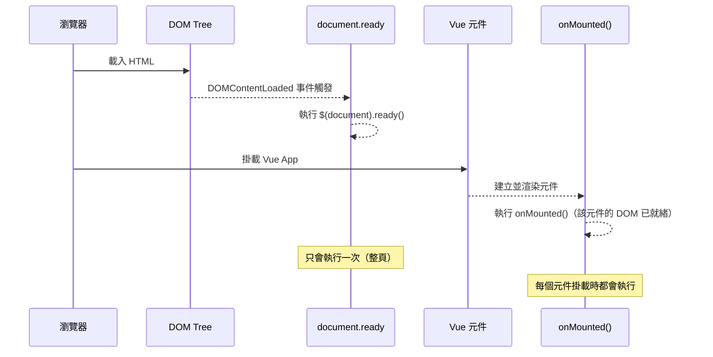
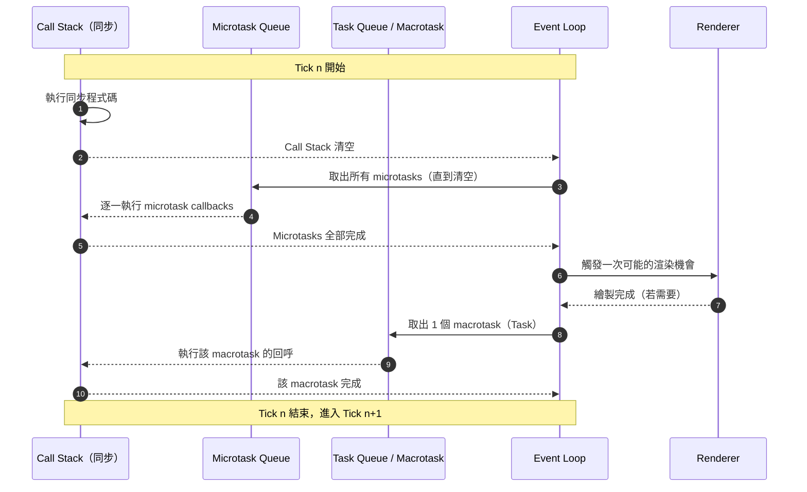

# HEX Vue3 Bootcamp Week 2

六角學院 Vue3 新手營 2025 第二周學習心得，包含課程回顧、筆記摘要、課堂練習、自我補充與回家作業等

# 建立環境

```sh
nvm use v20.19.3
```

```sh
npm create vite@latest
```

- Select a variant 選擇 `Official Vue Starter` 進入 Vue 官方建置設定，選擇：
  - Router
  - ESLint
  - Prettier

> [!note]
> 透過 `nvm` 可以有效的管理 `nodejs` 版本，設定請用 `nvm use vX.Y.Z`

```sh
cd {project-dir}
npm install
npm run format #使程式碼符合撰寫風格
npm run dev    #測試看看
```

> [!important]
> 上述如沒問題，可執行 `git init` 並進行第一次版控

# router

```sh
project
	src
		router # 新增一個名為 router 的資料夾
			index.js # router 設定
```

- 新增 `view` 可於 `index.js` 內設定，例如加入 `review`

```json
routes: [
    {
      path: '/review',
      name: 'review',  // name 可以省略，但某些寫法有用
      component: () => import('../views/ReviewView.vue'),
    },
  ],
```

- 於 `views` 資料夾新增 `ReviewView.vue`
- 於 `App.vue` 新增 `<RouterLink to="/review">Review</RouterLink>`

> [!note]
>
> - 使用 Router 的頁面會包含 `<RouterView />`，開頭記得 `import`
> - 綁定 `name` 的寫法將來路徑改變了也不用擔心
>   `<RouterLink :to="{ name: 'review' }">Review</RouterLink>`

# 重點回顧

- `TSS` 課堂新名詞 = Vue 三件套 `<template>` `<script>` `<style>`
- `<script setup>` 裡面通常有 `import { ref } from 'vue';`
- 變數習慣宣告為 `const`，值的部分包裹 `ref()`
- 函式使用箭頭函式 `const func = () => {}`
- 顯示資料常用 `{{}}`，其他還有 `v-text` `v-html` `v-once`
- 雙向綁定使用 `v-model="variableName"`
- `v-model` 修飾符常用 `.number` `.trim`
- `v-bind` 縮寫 `:`，`v-on` 縮寫 `@`
- `v-on` 也有修飾符，例如 `@click.prevent=""`
- DOM 原生事件可透過 `$event` 傳入，例如 `@click="show(msg, $event)"`
- `<button>` 建議加上 `type="button"` 否則預設為 `submit`
- 迴圈 `<li v-for="(item, idx) in items" v-bind:key="idx">`
- 不用索引 `<li v-for="item in items" :key="item.id">`
- 官方建議 `v-for` 一律加上 `:key`，綁定的欄位不可重複
- `v-for` 與 `v-if` 建議套用不同標籤，或搭配 `<template>` 分離
- `v-if` 還可搭配 `v-else` `v-else-if` 等
- `v-if` 會將整個 DOM 顯示或移除，並重新計算其生命週期
- `v-show` 也與顯示有關，隱藏套用 `display:none` 不移除 DOM

# 上週作業回顧與延伸

## 新增

```html
<button type="button" @click="addItem">Add</button>
```

```js
const addItem = () => {
  items.value.push({
    id: new Date().getTime(),
    name: newName.value,
    stock: newStock.value,
  })
}
```

## 刪除

```html
<button type="button" @click="removeItem(item.id)">Remove</button>
```

```js
const removeItem = (id) => {
  const idx = items.value.findIndex((item) => item.id === id)
  items.value.splice(idx, 1) //使用 splice 直接操作原陣列
}
```

# computed

- 可以把 `computed` 想成是一個「自動計算欄位」
- 在 Excel 裡，`ref` 像是直接填的儲存格資料
- `computed` 像是設定了公式的儲存格，會自動根據其他儲存格變化而更新

```js
import { ref, computed } from 'vue'

const totalStock = computed(() => {
  let sum = 0
  items.value.forEach((item) => {
    sum += item.stock
  })
  return sum
})
```

```html
<tfoot>
  <tr>
    <th scope="row" colspan="4">庫存總計</th>
    <td>{{ totalStock }}</td>
  </tr>
</tfoot>
```

# watch

- 有同學提到 `watch`，一起補充

| 特性     | `computed`           | `watch`                                      |
| -------- | -------------------- | -------------------------------------------- |
| 用途     | 產生新值             | 監聽變化並觸發程式                           |
| 回傳值   | 有                   | 無                                           |
| 快取     | 有                   | 無                                           |
| 適合情境 | 資料衍生、顯示、綁定 | API 請求、非同步處理、手動操作 DOM、記錄 Log |

```js
<script setup>
import { ref, watch } from 'vue';

const count = ref(0);

watch(count, (newVal, oldVal) => {
  console.log(`count 從 ${oldVal} 變成 ${newVal}`);
  // 例如：呼叫 API、儲存到 localStorage
});
</script>
```

# setTimeout

```js
setTimeout(() => {
  alert('三秒說哈囉')
}, 3000)
```

- 老師使用 `setTimeout` 模擬延遲資料回傳
- `setInterval` 與 `setInterval` 有點類似，比較如下

| 特性     | `setTimeout`                        | `setInterval`                |
| -------- | ----------------------------------- | ---------------------------- |
| 主要用途 | 延遲執行某個函式                    | 每隔固定時間 **重複** 執行   |
| 執行次數 | 只執行一次                          | 無限次，直到被清除           |
| 清除方式 | `clearTimeout(id)`                  | `clearInterval(id)`          |
| 常見應用 | 動畫延遲、啟動計時、一次性 API 呼叫 | 計時器、輪播圖、自動刷新資料 |

- **`setTimeout`**：像「倒數計時器」，時間到就執行一次，結束後不會再執行。
- **`setInterval`**：像「鬧鐘」，會一直按照設定的時間間隔觸發，直到被關閉。
- JavaScript 是單執行緒，如果前面的程式或事件阻塞了主執行緒，兩者的時間都可能延遲。

# Life Cycle

https://vuejs.org/guide/essentials/lifecycle.html

- 每個 Vue 元件都有自己生命週期
- Life Cycle Hook 可在生命週期某個階段添加自訂程式碼，例如

>  The `onMounted` hook can be used to run code after the component has finished the initial rendering and created the DOM nodes


- `onMounted` 好像類似 `document.ready`，但本質上還是不同東西
- `onMounted()`：只負責**該元件**，當元件進入 DOM 後執行
- `document.ready`：負責**整個頁面**，當 DOM Tree 建立完成後執行
- 實務上 `document.ready` 會先完成，才會開始掛載 Vue 元件



## onMounted

- 以下範例會延遲三秒才看到資料渲染，或者說
- Vue 元件掛載到 DOM 後，等待三秒再進行資料設定

```js
import { ref, onMounted } from 'vue'

const items = ref([])

onMounted(() => {
  //life cycle hook
  setTimeout(() => {
    //delay 3 sec
    items.value = [
      { id: 1, name: 'Item 1', stock: 10 },
      { id: 2, name: 'Item 2', stock: 20 },
    ]
  }, 3000)
})
```

# Task Queue

```js
console.log(1)
setTimeout(() => {
  console.log(2)
})
console.log(3)

// 輸出 1 3 2
```

- 因為 JavaScript 是單執行緒 + 事件迴圈（event loop） 的工作方式
- 同步程式碼先跑完，非同步工作的 callback 才從佇列取出執行
- `console.log(1)` 是同步，立即輸出 `1`。
- `setTimeout(..., 0)` 把回呼函式丟給瀏覽器的 **Web APIs** 計時器，等計時（最短也要一個 tick）結束後，把 callback 排到 Task Queue。此時不會立刻執行。
- `console.log(3)` 同步，立刻輸出 `3`。
- 主執行緒（Call Stack）清空後，**事件迴圈（Event Loop）** 才會把 Task Queue 的工作取進來執行，於是最後輸出 `2`。

## Tick

- 每一輪 tick 中，會先執行同步程式 `Call Stack`
- 再執行 `Microtask Queue`，例如 `Promise.then/catch/finally`
- 再執行 `Macrotask Queue`，例如 `setTimeout` `setInerval` I/O 與 UI 事件



```js
console.log('1-sync')

setTimeout(() => console.log('4-timeout'), 0)

Promise.resolve()
  .then(() => console.log('2-microtask'))
  .then(() => console.log('3-microtask'))

console.log('1.5-sync')
```

預期輸出：  
`1-sync` → `1.5-sync` → `2-microtask` → `3-microtask` → `4-timeout`

> [!important]
> AJAX（或更現代的 `fetch`）的非同步過程都依賴事件迴圈與佇列 callback

# Axios

- **Axios** 是一個 **基於 Promise 的 HTTP 客戶端**，主要用來在瀏覽器或 Node.js 發送 HTTP 請求
- 它封裝了 `XMLHttpRequest` 或 `http`，並增加許多便利功能，例如：
  - 自動轉換 JSON
  - 自動處理 `headers`
  - 請求與回應攔截器（Interceptors）
  - 自動取消請求（Cancel Token）
  - 跨瀏覽器相容性佳
  - 請求超時設定
  - 封裝更直觀的 API

```js
import axios from 'axios'

axios
  .get('/api/users')
  .then((res) => {
    console.log(res.data)
  })
  .catch((err) => {
    console.error(err)
  })
```

- **Fetch API** 是瀏覽器內建的 HTTP 請求 API（現代瀏覽器與 Node.js 18+ 皆內建支援）
- 直接使用 `fetch()` 函式發送請求，語法簡潔，並且同樣基於 Promise
- 原生、免安裝、適合輕量需求，但在錯誤處理與功能上需要自己額外包裝

> [!note]
> Axios 功能多、封裝好、攔截器方便、適合專案開發中大量使用 HTTP 的情況

Axios 得到的 `res` 主要包含

| 屬性         | 說明                                               |
| ------------ | -------------------------------------------------- |
| `data`       | **已解析**好的回應內容（若是 JSON 會自動轉成物件） |
| `status`     | HTTP 狀態碼（例如 200, 404）                       |
| `statusText` | 狀態碼文字（例如 `"OK"`、`"Not Found"`）           |
| `headers`    | 回應的標頭（物件形式）                             |
| `config`     | 當初發送請求的設定（`axios.get()` 時的參數）       |
| `request`    | 低層的請求物件（例如 `XMLHttpRequest` 實例）       |

# 實作 Sign Up

實作註冊功能，串接六角學院 Web API

https://todolist-api.hexschool.io/doc/

## Add Todo View

- `📁views` 新增 `TodoView.vue`
- `📁router` 修改 `index.js`，新增 `TodoView.vue` 設定
- 於 `App.vue` 新增 `todo` 的 Router 設定

> [!important]
>
> - 新增一個 `*.vue` 時，記得 `TSS` = `<template>` `<script>` `<style>`
> - 或至少要有 `<template>` (並且其中有內容)，不然編輯器會報錯

## Data Binding

- Add `script` and data structure
- Add `template` and data binding `v-model`

```html
<h1>{{ pageTitle }}</h1>
<h2>Sign Up</h2>
<input type="text" v-model="signUpModel.email" />
<input type="text" v-model="signUpModel.password" />
<input type="text" v-model="signUpModel.nickname" />
<button type="button">Sign Up</button>
<br />
{{ signUpModel }}
```

```js
import { ref } from 'vue'

const pageTitle = ref('Todo')

const signUpModel = ref({
  email: 'Brian',
  password: 'P@ssw0rd',
  nickname: 'dpi',
})
```

## Axios

```js
import axios from 'axios'

const baseURL = 'https://todolist-api.hexschool.io/'

const signUp = async () => {
  let api = `${baseURL}users/sign_up`
  const res = await axios.post(api, signUpModel.value) //記得 .value
  console.log(res) //觀察回傳結果 201/400/404
}
```

加上 `try...catch`

```js
const signUp = async () => {
  try {
    let api = `${baseURL}users/sign_up`
    const res = await axios.post(api, signUpModel.value)
    console.log(res)
    signUpRes.value = res.data
  } catch (error) {
    console.error(error)
  }
}
```

- 註冊結果可透過 `res.data` 取得，包含 `status` 與 `uid`
- Axios 會將 `20X` 以外的狀態碼封裝為錯誤，可自行拆解

# 實作 Sign In

```html
<h2>Sign In</h2>
<input type="text" v-model="signInModel.email" />
<input type="password" v-model="signInModel.password" />
<button type="button" @click="signIn">Sign In</button>
<hr />
{{ signInModel }}
<hr />
{{ signInRes }}
```

```js
import { ref, onMounted } from 'vue'
import axios from 'axios'

const baseURL = 'https://todolist-api.hexschool.io/'
const signInRes = ref('')

const signInModel = ref({
  email: '',
  password: '',
})

const signIn = async () => {
  try {
    let api = `${baseURL}users/sign_in`
    const res = await axios.post(api, signInModel.value)
    console.log(res)
    signInRes.value = res.data
  } catch (error) {
    console.error(error)
  }
}
```

- 基本上跟 Sign Up 大同小異，可複製程式進行修改
- 登入成功後會取得 `JWT`，自行保留在本地端運用
- 很多網站都使用這樣的驗證機制，例如臉書

> [!warning]
>
> - 他人如取得 `JWT` 且 `token` 尚未過期，便可登入該帳戶
> - `F12` > `Application` > `Cookies` 可管理 `Cookies`，包含取得與新增
> - `token` 就像臨時通行證，取得便可暢通無阻，所以離開電腦務必上鎖

# Cookie

## Save Token

```js
const res = await axios.post(api, signInModel.value)
document.cookie = `my-token=${res.data.token}; path=/`
```

- 取得 `token` 應自行寫入 Cookie，名稱與路徑可以自訂
- 可透過 `F12` > `Application` > `Cookie` 觀察寫入資料

## Get Token

```js
const checkout = async () => {
  //取出 cookie
  const token = document.cookie.replace(/(?:^|.*;\s*)my-token\s*=\s*([^;]*).*$/i, '$1')

  let api = `${baseURL}users/checkout`

  const res = await axios.get(api, {
    headers: {
      Authorization: token, //呼叫 api 時加入 token
    },
  })
}
```

- 使用正則表達式取出 `cookie`，並於呼叫 api 時放入 `header`
- 上述方法可於 `onMounted` 執行

```js
onMounted(async () => {
  await checkout()
})
```

# Homework

## 需求

- 參考課程完成 API 串接：[https://todolist-api.hexschool.io/doc/#/](https://todolist-api.hexschool.io/doc/#/)
- Level 1：串接課程 API，完成註冊、登入、驗證、登出
- Level 2：包含以上，並完成 TodoList
- Level 3：客製化版型，並在單頁完成

## 實作

https://dpi627.github.io/HexVueHw02/
